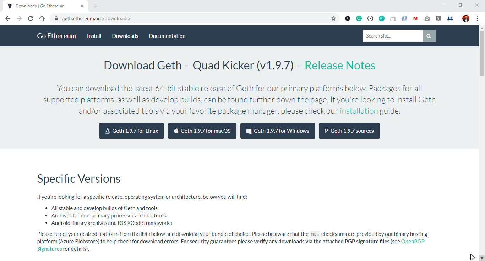
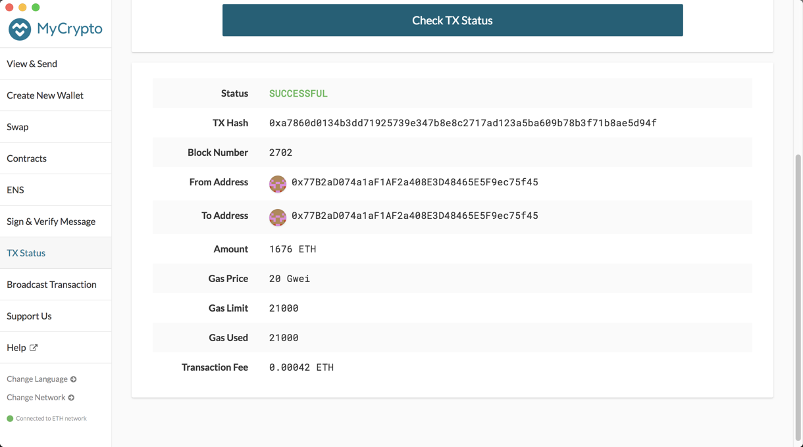

# **Proof of Authority Development Chain**

The PoA algo usually is used for private blockchain networks because it requires pre-approval of the account addresses that can approve transactions.

## **Installation Guide**
### **Installing MyCrypto Desktop App
[MyCrypto](https://mycrypto.com/) is a free, open-source client-side interface that allows you to interact directly with the blockchain.

Open your browser and navigate to the downloads page at [https://download.mycrypto.com/](https://download.mycrypto.com/)

Based on your OS, you will be redirected to the corresponding application installer. If you are not correctly redirected, choose the appropriate installer for your operating system and once you download the installer, open the file, and follow the installation wizard.

## **Installation Notes**
General Notes:

The first time you execute MyCrypto, you will see the following starting tutorial, I suggest to read trough as you click "Next" to continue.

Running in OS X:

The first time you execute MyCrypto, you will see the following warning message, you can safely click on the "Open" button to start the application.

### **Allowing Permission to Open Apps from Unidentified Developers**
When an app is not registered with Apple, it can be automatically blocked by the Mac OS operating system when attempting to open the "unidentified" application. Therefore, in order to allow the use of the MyCrypto app, you may need to allow it as an exception to your Mac OS security preferences. To do so perform the following.

- Open the MyCrypto app, it should produce a warning error saying that you cannot open the application due to security reasons. Therefore, we'll need to make a security exception for it.

- Look to the top-left of the screen and click on the Apple Logo and navigate to System Preferences > Security & Privacy.

- Click in the General tab and allow your MyCrypto application security access to be opened in the "Allow Apps Downloaded From" section. Your screen should look similar to the image below.

## **Installing Go Ethereum Tools**
Go Ethereum is one of the three original implementations of the Ethereum protocol. It is written in Go, fully open-source and licensed under the GNU LGPL v3.

I will use Go Ethereum Tools to create my own blockchain, from the genesis block to mining tokens and making transactions.

Despite there are installers for OS X and Windows, I will use the application executable binary files to have a seamless experience between both operating systems and avoid some technical issues that currently exist in Windows.

To install the Go Ethereum Tools, please follow the next steps:

Open your browser and navigate to the Go Ethereum Tools download page at https://geth.ethereum.org/downloads/

Scroll down to the "Stable Releases" section and proceed depending on your operating system.

Installing in OS X. Click on the "Geth & Tools 1.9.7" to download the applications bundle archive.

Installing in Windows.

You need to know if you are running a 32 bit or 64 bit version of Microsoft Windows, if you are not sure about that, you can check your version following [This steps.](https://support.microsoft.com/en-us/windows/which-version-of-windows-operating-system-am-i-running-628bec99-476a-2c13-5296-9dd081cdd808these)

Depending on your Windows version, you should download the 32 bit or 64 bit version of the Go Ethereum Tools.

After downloading the tools archive, open your "Downloads" folder, and you will find a file named geth-alltools-darwin-amd64-1.9.7-a718daa6.tar.gz in OS X, and a file called geth-alltools-windows-amd64-1.9.7-a718daa6.zip in Windows. Note that the last numbers in the filename could vary depending on the last built available.

Decompress the archive in the location of your preference in your computer's hard drive, and rename the containing folder as Blockchain-Tools. I recommend using a location that can be easily accessed from the terminal window like the user's home directory.

### **Let's Start it.**
1. Open your Terminal and navidate to a folder Blockchain-Tools. Switch from base to ethereum environment (conda activate ethereum). After, you will generate two new nodes with new account addresses that will serve as our pre-approved sealer addresses.

- Create accounts for two nodes for the network with a separate datadir for each using geth:

     - ./geth --datadir node1 account new (it will give you 'Public address of the key: 0x7D4247280Fb0090548FC66FD8d51090De4F1b0a4' and 'Path of the secret key file'. Save both in a notebook for your reference. You will need a "Public address" later.)
    * ./geth --datadir node2 account new (it will give you 'Public address of the key': 0x7Bb859b0acAD412c747292d027B7A4659e9191D6 and 'Path of the secret key file'. Save both in a notebook for your reference. You will need a "Public address" later.)
2. Next, generate your genesis block.

    - Run ./puppeth command in your Terminal, name your network (in my case, I named it "ubernet"), and select the option to configure a new genesis block.

    - Choose the Clique (Proof of Authority) consensus algorithm.

    - Paste both account addresses from the first step one at a time into the list of accounts to seal (see above for the addresses).

    - Paste them again in the list of accounts to pre-fund. There are no block rewards in PoA, so you'll need to pre-fund.

    - You can choose no for pre-funding the pre-compiled accounts (0x1 .. 0xff) with wei. This keeps the genesis cleaner.

    - Add Chain ID. It can be any random number. In my case: 999.

    - Complete the rest of the prompts, and when you are back at the main menu, choose the "Manage existing genesis" option.

    - Export genesis configurations. This will fail to create two of the files, but you only need ubernet.json.

3. With the genesis block creation completed, you will now initialize the nodes with the genesis' json file.

- Using geth, initialize each node with the new ubernet.json.
    - ./geth --datadir node1 init ubernet.json
    - ./geth --datadir node2 init ubernet.json

4. Now the nodes can be used to begin mining blocks.

- Run the nodes in separate terminal windows with the commands:
    - ./geth --datadir node1 --unlock "0x7D4247280Fb0090548FC66FD8d51090De4F1b0a4" --mine --rpc --allow-insecure-unlock
    - ./geth --datadir node2 --unlock "0x7Bb859b0acAD412c747292d027B7A4659e9191D6" --mine --port 30304 --bootnodes "enode://SEALER_ONE_ENODE_ADDRESS@127.0.0.1:30303" --ipcdisable --allow-insecure-unlock
- NOTE: Type your password and hit enter - even if you can't see it visually or trying adding --password pw.txt and saving an actual passwrod in txt file in the Blockchain-Tools folder.
- NOTE: Add --syncmode full and/or --minerthreads if your are having trouble with nodes mining.

5. Now yoour private PoA blockchain should now be running!
6. With both nodes up and running, the blockchain can be added to MyCrypto for testing.

- Open the MyCrypto app on your desktop, then click Change Network at the bottom left:

- Click "Add Custom Node", then add the custom network information that you set in the genesis.

- Make sure that you scroll down to choose Custom in the "Network" column to reveal more options like Chain ID. In my case, my chain id was 777:

- Type ETH in the Currency box.

- In the Chain ID box, type the chain id you generated during genesis creation.

- In the URL box type: http://127.0.0.1:8545. This points to the default RPC port on your local machine.

- Finally, click Save & Use Custom Node.

7. After connecting to the custom network in MyCrypto, it can be tested by sending money between accounts.
    - Select the View & Send option from the left menu pane, then click Keystore file.
    

- On the next screen, click Select Wallet File, then navigate to the keystore directory inside your Node1 directory, select the file located there, provide your password when prompted and then click Unlock.

- This will open your account wallet inside MyCrypto.

- Looks like we're filthy rich! This is the balance that was pre-funded for this account in the genesis configuration; however, these millions of ETH tokens are just for testing purposes.

- In the To Address box, type the account address from Node2, then fill in an arbitrary amount of ETH:

- Confirm the transaction by clicking "Send Transaction", and the "Send" button in the pop-up window.

- Click the Check TX Status when the green message pops up, confirm the logout.

- You should see the transaction go from Pending to Successful in around the same blocktime you set in the genesis.

- You can click the Check TX Status button to update the status.

